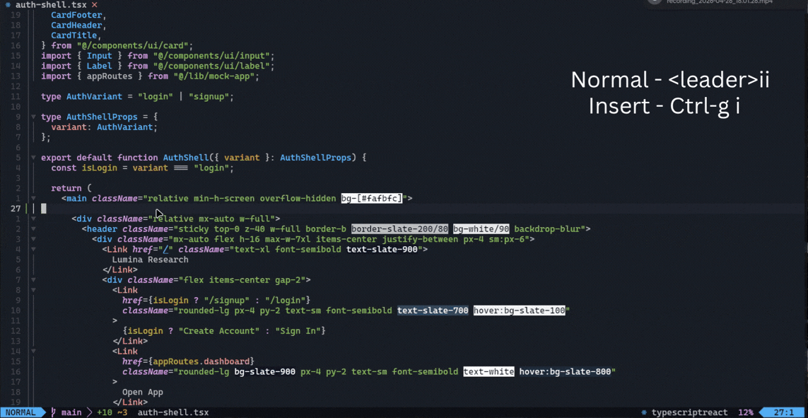
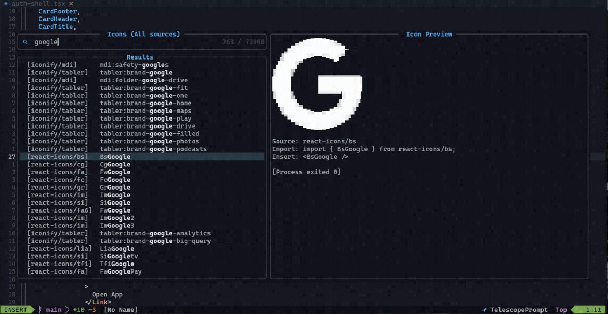

# icon-picker.nvim

Lightweight Neovim picker for React icons.

- Sources: `lucide-react`, `react-icons/*`, `@iconify-json/*`
- Inserts JSX icon at cursor
- Adds safe import at top (`"use client"` aware)
- Handles multiline imports safely
- Preview support for Telescope and snacks.nvim

## Demo

### Open Picker



### Change Source



## Requirements

- Neovim >= 0.9
- One picker UI:
  - [telescope.nvim](https://github.com/nvim-telescope/telescope.nvim)
  - [snacks.nvim](https://github.com/folke/snacks.nvim) with `picker.enabled = true`
- Node project with `node_modules`
- At least one icon source package:
  - `lucide-react`
  - `react-icons`
  - `@iconify/react` plus one or more local icon sets, e.g. `@iconify-json/mdi`

Preview:

- `node`
- `react` + `react-dom` for the `react-icons` preview render path
- Telescope preview: `chafa` (optional but recommended)
- snacks.nvim image preview:
  - snacks `image = { enabled = true }`
  - supported terminal: Kitty, Ghostty, or WezTerm
  - ImageMagick (`magick` or `convert`) for SVG -> PNG cache conversion

## Installation (lazy.nvim, Telescope)

```lua
{
  "SaptanshuWanjari/icon-picker.nvim",
  dependencies = {
    "nvim-telescope/telescope.nvim",
    "nvim-lua/plenary.nvim",
  },
  opts = {
    command = "IconPicker",
    keymaps = {
      normal = "<leader>ii",
      insert = "<C-g>i",
    },
    picker = {
      ui = "telescope",
      toggle_source_key = "<C-t>",
      notify_source_toggle = false,
      stopinsert_on_open = true,
      telescope = {},
    },
  },
  config = function(_, opts)
    require("icon_picker").setup(opts)
  end,
}
```

## Installation (lazy.nvim, snacks.nvim)

```lua
{
  "SaptanshuWanjari/icon-picker.nvim",
  dependencies = {
    {
      "folke/snacks.nvim",
      opts = {
        picker = { enabled = true },
        image = { enabled = true },
      },
    },
  },
  opts = {
    command = "IconPicker",
    keymaps = {
      normal = "<leader>ii",
      insert = "<C-g>i",
    },
    picker = {
      ui = "snacks",
      toggle_source_key = "<C-t>",
      stopinsert_on_open = true,
      preview_cache_max_age = 60 * 60 * 24 * 7, -- 7 days; set 0 to disable cleanup
      snacks = {
        -- any snacks.nvim picker opts override
        -- layout = { preset = "default" },
      },
    },
  },
  config = function(_, opts)
    require("icon_picker").setup(opts)
  end,
}
```

## Usage

- `:IconPicker`
- Choose a source first: `All sources`, `Lucide`, `React Icons`, or `Iconify`
- Select icon -> plugin inserts import + `<IconName />`
- Iconify selections insert `<Icon icon="prefix:name" />` from `@iconify/react`
- In the icon picker, `<C-t>` reopens the source selector and reloads the picker with the selected source only

## Configuration

```lua
require("icon_picker").setup({
  command = "IconPicker", -- set false/nil/"" to disable command
  keymaps = {
    normal = nil,          -- e.g. "<leader>ii"
    insert = nil,          -- e.g. "<C-g>i"
  },
  picker = {
    ui = "telescope", -- "telescope" or "snacks"
    preview_cache_max_age = 60 * 60 * 24 * 7, -- 7 days; set 0 to disable cleanup
    stopinsert_on_open = true,
    toggle_source_key = "<C-t>",
    notify_source_toggle = false,
    snacks = {
      -- any snacks.nvim picker opts override
      -- layout = { preset = "default" },
    },
    telescope = {
      -- any Telescope picker opts override
      -- layout_strategy = "horizontal",
      -- layout_config = { width = 0.95, height = 0.85 },
    },
  },
})
```

## Notes

- Import logic avoids destructive rewrite of complex imports.
- If source missing, picker filters automatically.
- Lucide preview has fallback path even when React render path fails.
- Iconify support is offline-only and reads installed `@iconify-json/{prefix}/icons.json` files.
- Selecting an unavailable source shows a warning instead of opening an empty picker.
- snacks.nvim previews cache rendered SVG/PNG files in `stdpath("cache")/icon-picker.nvim`.
- The preview cache is cleaned once per Neovim session. Files older than `picker.preview_cache_max_age` are removed.

## License

MIT
